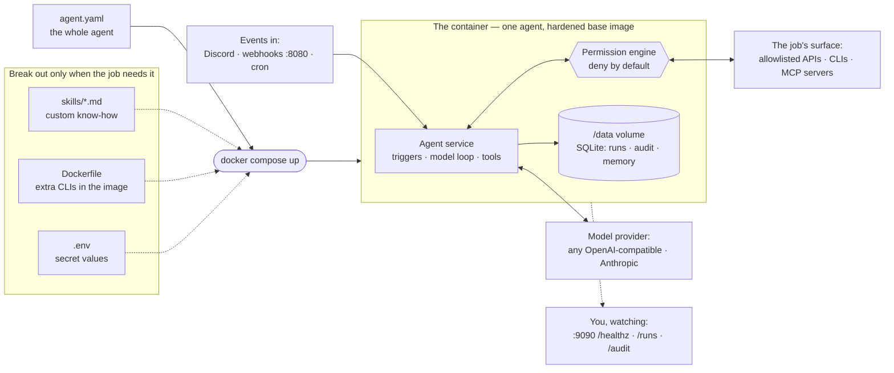

import { Card, Cards } from 'fumadocs-ui/components/card';

## Looped Agent Framework

```txt
   ██╗      ██████╗  ██████╗ ██████╗ ███████╗██████╗      █████╗ ███████╗
   ██║     ██╔═══██╗██╔═══██╗██╔══██╗██╔════╝██╔══██╗    ██╔══██╗██╔════╝
   ██║     ██║   ██║██║   ██║██████╔╝█████╗  ██║  ██║    ███████║█████╗
   ██║     ██║   ██║██║   ██║██╔═══╝ ██╔══╝  ██║  ██║    ██╔══██║██╔══╝
   ███████╗╚██████╔╝╚██████╔╝██║     ███████╗██████╔╝    ██║  ██║██║
   ╚══════╝ ╚═════╝  ╚═════╝ ╚═╝     ╚══════╝╚═════╝     ╚═╝  ╚═╝╚═╝
```

### Overview 

The **Looped Agent Framework** is a framework for building and deploying AI agents as services. These are generally single-purpose agents
that sit in a loop: wait for an event (a Discord message, a webhook, a cron tick), do
their one job, deliver the result, go idle.

The core idea is that *an agent is a file*. A simple config file that defines the agents purpose, the model, the tools,
and the boundaries.

```yaml title="agent.yml"
handle: issue-bot     # agents name themselves; you just pick the handle
description: Turns team Discord messages into GitHub issues.
model: { provider: openai-compatible, id: gpt-5.4-mini }
triggers:
  - type: discord
    channels: ["issues"]
skills:
  - ./skills/gh-issues.md
permissions:
  net: [discord.com, gateway.discord.gg, api.github.com]
  run: [gh]
```

### Deployment

Deploying an agent is one command, and there is a shape for every setup.

**`docker run`** is the quickest path: mount the agent file onto the published base image.

```sh
docker run -d \
  -v ./agent.yaml:/agent/agent.yaml:ro \
  --env-file .env \
  -v agent-data:/data \
  ghcr.io/loopedautomation/agent:latest
```

**`docker compose`** is the standard shape for anything long-lived: one service block per
agent, with the volume, env file, and restart policy written down. A fleet is the same
file with more service blocks — and the agent config can even be
[inlined into the compose file](/agent-framework/docker-compose#one-compose-file-the-whole-agent-inline),
so that a single `compose.yaml` is the entire deployment.

```yaml
services:
  issue-bot:
    image: ghcr.io/loopedautomation/agent:latest
    volumes:
      - ./agent.yaml:/agent/agent.yaml:ro
      - issue-bot-data:/data
    env_file: .env
    restart: unless-stopped
volumes:
  issue-bot-data:
```

**The `af` CLI** is the development path: `af run agent.yaml` runs the agent directly on
your machine, as an interactive REPL without triggers or as the full service with them.
`af init` scaffolds a complete project in any of the shapes above, exact deploy steps
included — see the [CLI reference](/agent-framework/cli).

However you launch it, the same thing runs: one agent in one hardened container.



You author one file — the [agent file](/agent-framework/agent-file) *is* the agent — and
`docker compose up` does the rest. Each concern breaks out into its own file only when the
job calls for it: [skills](/agent-framework/skills) when the agent needs know-how beyond
the pre-defined ones, a Dockerfile layer when it needs a CLI the base image doesn't carry,
`.env` when the config references secrets. The result is one container per agent: inside
it, the service listens for its channels — [Discord](/agent-framework/discord),
[webhooks](/agent-framework/webhook), [cron](/agent-framework/cron) — talks to whichever
model provider you configured, and reaches the outside world only through the
deny-by-default [permission engine](/agent-framework/permissions). Everything the agent
does lands in SQLite on the `/data` volume, and the
[status surface](/agent-framework/docker-run#the-status-surface) on port 9090 tells you
it's healthy. Running a fleet means running more of the same — the full story is in
[Docker compose](/agent-framework/docker-compose).

The hardened base image is what makes an agent safe to run unattended. It's minimal —
the runtime, the framework, bash, and nothing else, no browser, no extras — so the attack
surface stays small. The process runs as a non-root user, the sandbox scopes file reads
and writes to the agent's own directories, and a built-in healthcheck surfaces each
agent's state in `docker ps`. Because the container is the unit of isolation, a
misbehaving agent is contained to one container — not your host, and not the rest of the
fleet. The full list of what the base image provides is in
[Docker run](/agent-framework/docker-run#what-the-base-image-gives-you).

## The Manifesto 

Start with the [manifesto](https://github.com/loopedautomation/agent-framework/blob/main/MANIFESTO.md) - it's a short read and outlines the philosophy behind the framework.

## Next Steps

<Cards>
  <Card
    title="Quick start"
    description="From an empty directory to a running agent in about five minutes."
    href="/agent-framework/quick-start"
  />
  <Card
    title="Agent Config"
    description="A guided tour of every block in agent.yaml — identity, model, memory, limits, and env."
    href="/agent-framework/agent-file"
  />
  <Card
    title="Discord"
    description="Connect an agent to Discord: setup, in-channel replies, and observer agents."
    href="/agent-framework/discord"
  />
  <Card
    title="Webhook"
    description="Run the agent over HTTP: an authenticated endpoint that returns the run result."
    href="/agent-framework/webhook"
  />
  <Card
    title="Cron"
    description="Run the agent on a schedule with a cron expression and a prompt."
    href="/agent-framework/cron"
  />
  <Card
    title="Skills"
    description="Teach the agent to use any CLI or API with a markdown file. Skills add knowledge, never capability."
    href="/agent-framework/skills"
  />
  <Card
    title="Tools"
    description="The native toolset, MCP servers, and tool search. Capability is added deliberately, never by default."
    href="/agent-framework/tools"
  />
  <Card
    title="Permissions"
    description="Deny-by-default allowlists, denials as information, secrets, and the sandbox layers."
    href="/agent-framework/permissions"
  />
  <Card
    title="Docker run"
    description="Run an agent with a single docker run: the published base image, custom images, the status surface, and the data volume."
    href="/agent-framework/docker-run"
  />
  <Card
    title="Docker compose"
    description="Run one or many agents with Docker Compose: service blocks, fleets, inline config, and secrets."
    href="/agent-framework/docker-compose"
  />
  <Card
    title="CLI"
    description="Every af command: init, run, validate, flags, schema, discord-invite."
    href="/agent-framework/cli"
  />
  <Card
    title="Models"
    description="The two provider dialects, API keys, local models, retry behavior, and cost reporting."
    href="/agent-framework/models"
  />
</Cards>

The framework is built in the open:
[loopedautomation/agent-framework](https://github.com/loopedautomation/agent-framework)
— and the
[examples](https://github.com/loopedautomation/agent-framework/tree/main/examples)
are complete, runnable agents, from a minimal REPL bot to a Discord → GitHub agent
deployed with `docker compose up`.
